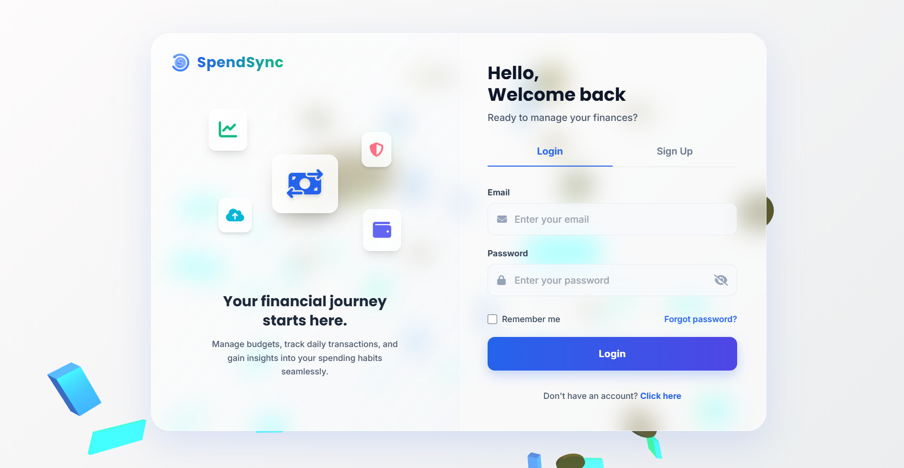
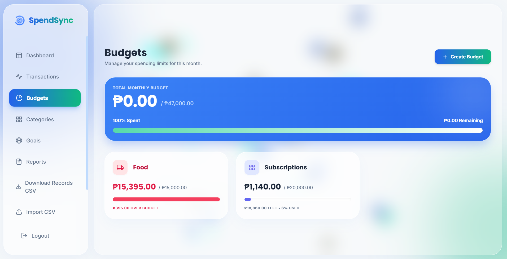
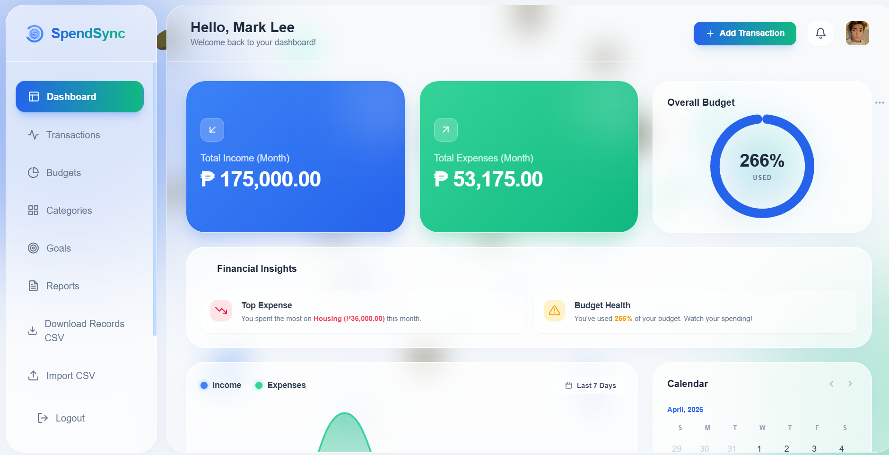
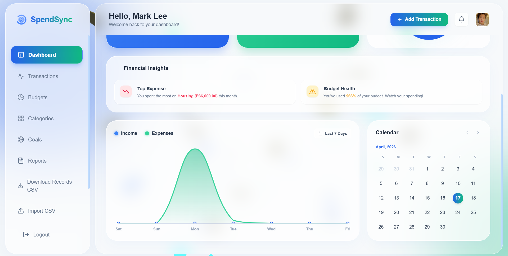
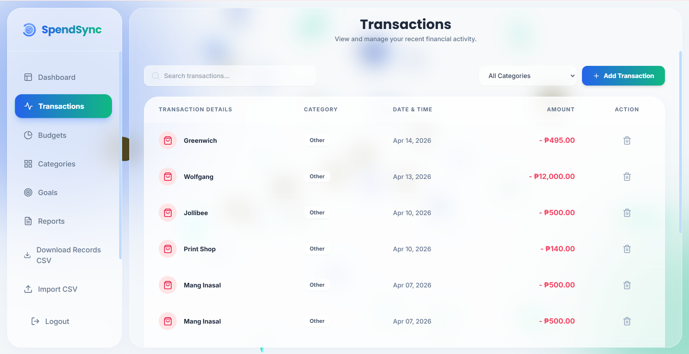

# SpendSync - Personal Finance Tracker

SpendSync is a centralized financial web application designed to help individuals track their income, monitor expenses, and establish secure budgets. Built with a modern "Glassmorphism" UI and integrated 3D visual elements.

## Features
* **User Authentication:** Secure login, signup, and password recovery.
* **Interactive Dashboard:** Real-time analytics, dynamic charts, and financial insights.
* **Income & Expense Tracking:** Easy logging of daily transactions.
* **Budget Management:** Set and track monthly spending limits.
* **Data Export/Import:** Seamless backup using CSV format.

## Technologies Used
* **Frontend:** HTML5, Tailwind CSS, Feather Icons, Three.js, Chart.js, GSAP
* **Backend:** PHP 8
* **Database:** MySQL

## Setup Instructions
1. Clone the repository: `git clone https://github.com/your-repo/SpendSync.git`
2. Import the database schema from `database/budget_db.sql` into your local MySQL server.
3. Update `config.php` with your local database credentials.
4. Run the project on a local server (XAMPP/WAMP).

## Screenshots 

| View                      | Preview       |
| ------------------------- | ------------- |
| Login              | |
| Budget Page        |  |
| User Dashboard     |  |
| User Dashboard   | |
| Transaction      | |

# Contributors 
1. Epetia, Princess Alexis 
2. Pagdanganan, Brett Michael
3. Salinas, Sherilyn
4. Santos, Realyn

**Developed by Group 1 - IT 211 Web Systems and Technologies**
